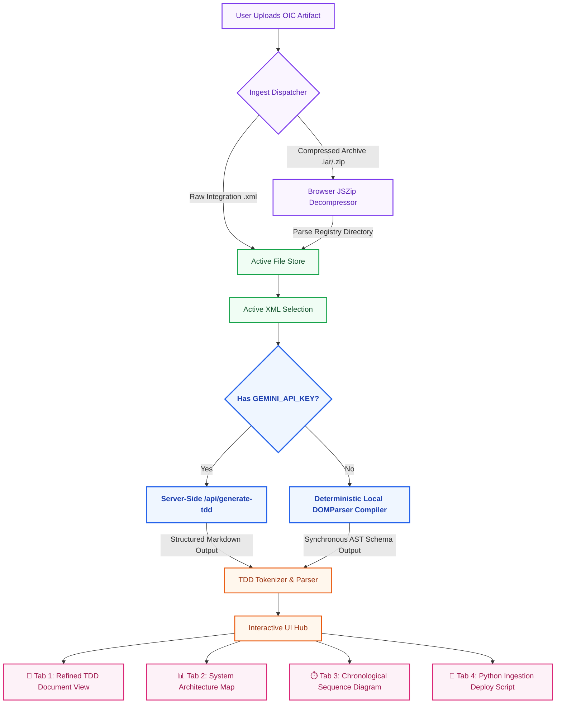

# 🛠️ Enterprise OIC Metadata Visualizer & Document Compiler

A high-performance, full-stack enterprise web application built to digest raw **Oracle Integration Cloud (OIC)** XML metadata structures and compressed `.iar` (Integration Archive) files. It automatically compiles comprehensive, industry-standard **Technical Design Documents (TDD)** and renders interactive orchestration visual topologies in real-time.

---

## 🗺️ Project Architecture & Workflow

The diagram below conceptualizes the pipeline of the application, showing how source integration artifacts are securely ingested, parsed, compiled, and turned into interactive system diagrams and deployable scripts:



---

## 🌟 Interactive Features Breakdown

### 📂 Archive File Ingestion (`/src/utils/iarExtractor.ts`)
- Utilizes full stream decompression to navigate compressed `.iar` or `.zip` files.
- Extracts internal orchestration, metadata schema layouts, mappings, and configuration properties.
- Displays an interactive, responsive nested directory directory tree of file contents.

### ⚙️ Compilation Core (Dual-Engine Mode)
1. **Generative LLM Engine**: Securely proxies metadata payloads via `/api/generate-tdd` protecting credentials, using advanced prompt formatting to refine variables, describe connection faults, and document complex integration rules.
2. **Deterministic Local Fallback (`/src/utils/localAnalyzer.ts`)**: In the absence of an API key, the local parser takes over:
   - Uses browser-native DOM namespaces to dissect `<partnerLink>`, `<invoke>`, `<assign>`, `<forEach>`, and `<switch>` namespaces.
   - Extracts trigger-to-invoke relationships, recurrent timers, and variables.
   - Translates nodes programmatically into syntactically flawless, styling-optimized **Mermaid.js** diagrams.

### 📊 Diagrammatic Modeling Engine (`/src/components/MermaidRenderer.tsx`)
- Renders dynamic SVG illustrations natively within responsive canvas layouts.
- Auto-detects resize viewport adjustments through customized DOM Resize Observers for crisp layout presentation.

### 🐍 Automation Engine (`/src/components/PythonInstructions.tsx`)
- Auto-compiles an executable Python deployment package.
- Features deep validation, error logging rules, schema unpacking, and automated upload procedures to keep your local automation pipelines in lockstep with the cloud.

---

## 🛠️ Local Server Setup & Run Instructions

Follow these instructions to run the application on your computer:

### 1. Pre-requisites
Ensure you have **Node.js** (v18 or higher) and **npm** installed.

### 2. Installations
Go to the project root directory and run:
```bash
npm install
```

### 3. Configure the Host Environment (Optional)
This application operates client-side fallback features seamlessly. To unlock generative optimization, create a `.env` file:
```env
GEMINI_API_KEY=your_secured_gemini_api_key
```

### 4. Direct Development Boot
```bash
npm run dev
```
Navigate to **`http://localhost:3000`** in your browser.

### 5. Production Compilation
```bash
npm run build
```
This script compiles the static frontend folder in `dist/` and compiles the backend server file into `dist/server.cjs` for lightning-fast application launch times.

To launch the compiled server, run:
```bash
npm start
```

---

## ☁️ How to Host Your Visualizer App on OCI (Oracle Cloud Infrastructure) for Free

Oracle Cloud Infrastructure offers a generous **Always Free Tier** providing high-spec compute resources ideal for running this full-stack Node.js server to analyze OIC artifacts.

### 🖥️ Deployment on OCI Compute Instance (ARM Ampere / VM Standard)

#### Step 1: Create Your OCI Free Account
1. Visit **[oracle.com/cloud/free/](https://www.oracle.com/cloud/free/)** and sign up.
2. Log into the OCI Console dashboard.

#### Step 2: Establish Virtual Network Ingress Rules
1. Navigate to **Networking > Virtual Cloud Networks**. Select or create your VCN.
2. Click on your active subnet's **Default Security List**.
3. Click **Add Ingress Rules**:
   - **Source Type**: CIDR
   - **Source CIDR**: `0.0.0.0/0` (Allows global HTTP traffic)
   - **IP Protocol**: TCP
   - **Destination Port Range**: `80`, `443`, and `3000` (for Node.js)
   - Click **Add**.

#### Step 3: Provision Your VM Compute Instance
1. Go to **Compute > Instances > Create Instance**.
2. **Name**: `OIC-Visualizer-VM`
3. **Image and Shape**: 
   - Click *Edit*. Select **Ubuntu** or **Oracle Linux** as your OS image.
   - For Shape, select **Change Shape** > Choose **Ampere (ARM-based)** > Select **VM.Standard.A1.Flex**.
   - Assign **1 OCPU** and **6 GB Memory** (completely Always Free).
4. **Primary Network**: Connect to the VCN and subnet configured in Step 2.
5. **Add SSH Keys**: Select *Generate a key pair* or upload your public key. Make sure to download the **Private Key** file!
6. Click **Create** and wait for the instance status to turn green (Running).

#### Step 4: Login and Install System Dependencies
Open your local terminal and connect to your instance using the downloaded SSH private key:
```bash
ssh -i your_downloaded_private_key.key ubuntu@<YOUR_OCI_PUBLIC_IP>
```

Install System Updates, Git, and Node.js:
```bash
# Update local packages database
sudo apt update && sudo apt upgrade -y

# Install Node.js LTS and Git
sudo apt install -y git curl
curl -fsSL https://deb.nodesource.com/setup_20.x | sudo -E bash -
sudo apt install -y nodejs

# Verify Installations
node -v
npm -v
```

#### Step 5: Pull Code and Launch Server
1. Clone the repository containing this project:
   ```bash
   git clone <YOUR_GIT_REPOSITORY_URL>
   cd <PROJECT_DIR_NAME>
   ```
2. Setup package environments and compile:
   ```bash
   npm install
   npm run build
   ```
3. Use **PM2** (Production Process Manager) to keep the Express server running 24/7 inside the background container:
   ```bash
   sudo npm install -g pm2
   pm2 start dist/server.cjs --name "oic-comp-visualizer"
   pm2 save
   pm2 startup
   ```

Now open your web browser and go to `http://<YOUR_OCI_PUBLIC_IP>:3000` to access your live OIC Metadata Visualizer!

---

## 🐙 Push Your Code Workspace to GitHub

Manage your codebase and push updates directly to your GitHub repository using these steps:

### 🚀 Direct Workspace Integration
1. Click the **Settings / Actions** menu inside Google AI Studio's user interface.
2. Select **Export to GitHub**.
3. Grant repository write permissions, declare your repository name, and submit changes in one consolidated deployment!

### 💻 Manual Git Uploads
Alternatively, if you downloaded the project files as a local `.zip` file on your computer, execute these commands inside your local project terminal:

1. **Initialize Git**:
   ```bash
   git init
   ```
2. **Exclusion Check**:
   Confirm that `.gitignore` contains `node_modules` and build directories so you don't commit large temporary files.
3. **Stage All Assets**:
   ```bash
   git add .
   ```
4. **Commit Locally**:
   ```bash
   git commit -m "feat: complete robust dual-mode oic document visualizer application"
   ```
5. **Establish GitHub Origin**:
   Log into your [GitHub account](https://github.com), make a new empty repository (named `oic-metadata-visualizer`), and link it:
   ```bash
   git branch -M main
   git remote add origin https://github.com/<your_username>/oic-metadata-visualizer.git
   ```
6. **Push to Remote**:
   ```bash
   git push -u origin main
   ```

*Crafted as a professional, lightweight system tool with zero visual clutter.*
